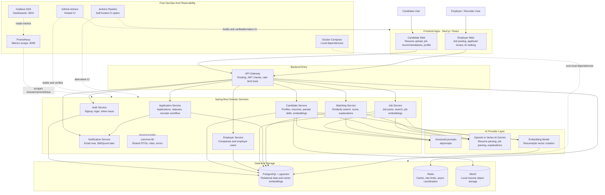
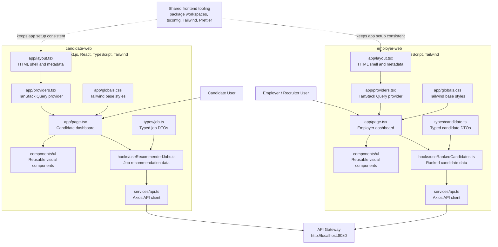
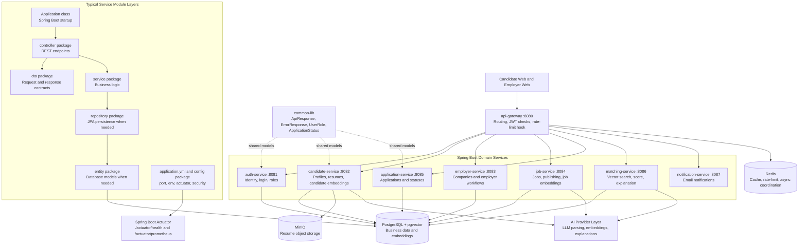
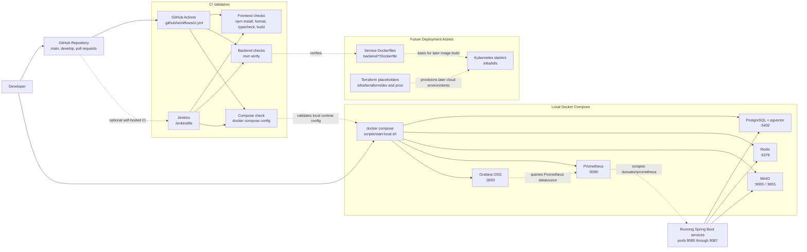
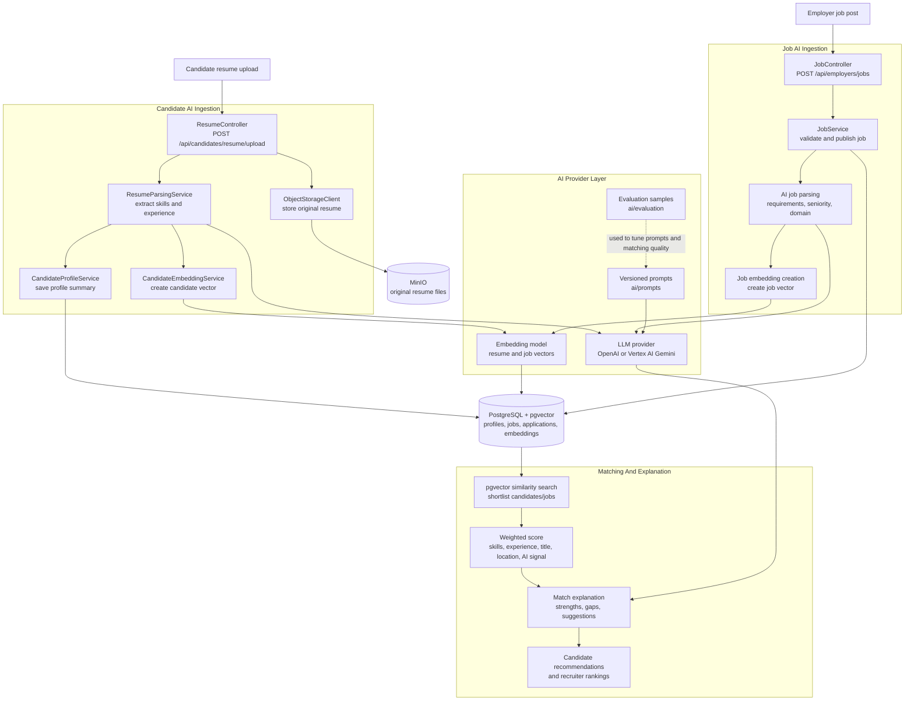
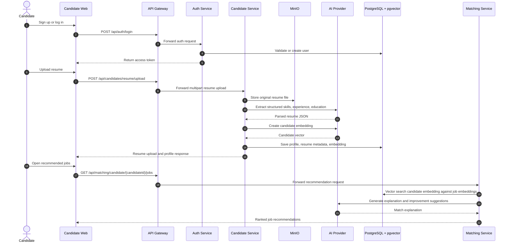
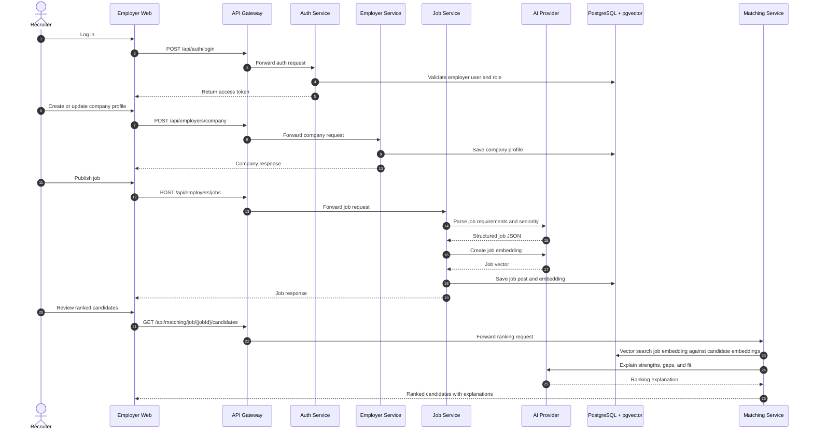
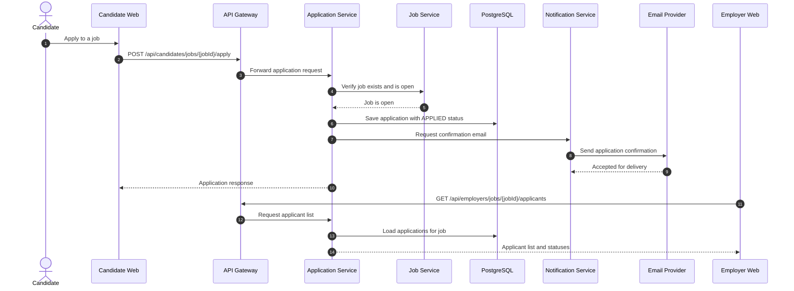
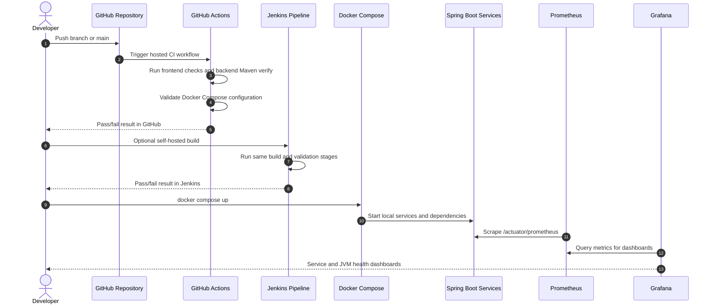

# MVP Architecture

## Runtime Shape

The MVP uses a monorepo with separate web apps and microservice-style Spring
Boot services.
PostgreSQL with pgvector stores operational data and vector embeddings. Redis is
reserved for short-lived cache, rate limiting, and async coordination. MinIO is
used locally for resume object storage. Prometheus scrapes Spring Boot Actuator
metrics, and Grafana displays service health and JVM/application dashboards.

## Whole System Architecture Diagram

This diagram shows the full MVP runtime from users to frontend apps, gateway,
domain services, AI integrations, storage, DevOps, and observability. The arrows
show the normal request/data direction. Services remain in one monorepo for MVP
speed, but each backend module has a clear boundary so it can later be deployed
independently.

### Whole System Process Explained

The whole-system diagram should be read from top to bottom:

1. Users start in one of the two web apps. Candidates use `candidate-web`
   for resume upload, profile review, job recommendations, and applying.
   Employers and recruiters use `employer-web` for company setup, job
   posting, applicant review, and candidate ranking.
2. Both web apps call the API Gateway instead of calling every backend
   service directly. This keeps one backend entry point for routing,
   authentication checks, future rate limiting, and future cross-cutting
   concerns such as request IDs.
3. The API Gateway forwards requests to the correct domain service.
   Authentication requests go to Auth Service, resume/profile requests go
   to Candidate Service, job requests go to Job Service, application
   requests go to Application Service, and matching requests go to
   Matching Service.
4. Domain services persist operational records in PostgreSQL. Examples
   include users, candidate profiles, resume metadata, jobs, applications,
   and matching data. PostgreSQL also uses pgvector so resume and job
   embeddings can be stored and searched in the same primary database.
5. Candidate Service stores original uploaded resume files in MinIO. MinIO
   acts like local S3-compatible object storage, while PostgreSQL stores
   metadata and parsed profile data.
6. Candidate Service, Job Service, and Matching Service use the AI provider
   layer. The provider layer represents prompt files, LLM calls, and
   embedding generation. Prompt templates live in `ai/prompts` so they can
   be versioned, reviewed, and improved over time.
7. Matching works by combining stored embeddings, deterministic scoring,
   and AI-generated explanations. The system first narrows candidates/jobs
   through vector similarity, then applies business weighting, then
   produces explanation text for candidates or recruiters.
8. Notification Service is called when the platform needs to send messages,
   such as application confirmation email. It starts with email and leaves
   room for SMS, WhatsApp, and push notifications later.
9. Docker Compose runs local dependencies such as PostgreSQL, Redis, MinIO,
   Prometheus, and Grafana. It gives every developer a repeatable local
   platform without requiring Kubernetes for MVP development.
10. Prometheus scrapes `/actuator/prometheus` from running Spring Boot
    services, and Grafana queries Prometheus to display service health,
    memory usage, and request-rate dashboards.
11. GitHub Actions and Jenkins validate code changes. They check frontend
    formatting/type/build, backend Maven verification, and Docker Compose
    configuration before a change is trusted.

The important architectural idea is separation of responsibilities:
frontend apps own user experience, the gateway owns entry/routing,
services own business domains, storage systems own durable data, AI
components own parsing/embeddings/explanations, and DevOps/observability
components own validation and runtime visibility.

## Breakdown Diagrams

The whole-system diagram explains how the major platform pieces connect. The
diagrams below zoom into the main engineering areas so a reader can understand
the frontend structure, backend service layering, DevOps workflow, and AI/data
path independently.

### Frontend Breakdown Diagram

Both web apps use the same structure: Next.js App Router for pages/layout,
React providers for shared client state, hooks for data fetching, Axios clients
for API calls, typed DTOs, and small reusable UI components.

#### Frontend Process Explained

The frontend process starts with the user opening either the candidate app
or employer app:

1. `app/layout.tsx` defines the page shell and metadata for the Next.js
   app. This is where shared page structure begins.
2. `app/providers.tsx` wraps the app with client-side providers such as
   TanStack Query. This gives pages and hooks a shared place for request
   caching, loading state, and refetch behavior.
3. `app/page.tsx` is the first dashboard page for the app. In the candidate
   app, it presents candidate-focused job-search information. In the
   employer app, it presents employer-focused recruiting information.
4. Page components use UI components from `components/ui` for reusable
   display pieces such as statistic cards. This avoids copying the same
   visual pattern into every page.
5. Page components call hooks such as `useRecommendedJobs` or
   `useRankedCandidates`. Hooks isolate data-fetching behavior from the
   page, which keeps pages easier to read and makes loading/error handling
   easier to standardize.
6. Hooks call `services/api.ts`, which contains the Axios API client. Axios
   centralizes the backend base URL and request behavior.
7. Type files such as `types/job.ts` and `types/candidate.ts` describe the
   expected data shape. This helps TypeScript catch mismatches between UI
   code and backend response contracts.
8. The frontend API client sends requests to the API Gateway on
   `http://localhost:8080`. The web apps do not need to know which backend
   service ultimately owns each request.
9. Shared workspace tooling keeps both web apps consistent. The root
   package workspace runs formatting, typecheck, and build commands across
   both apps.

In short: user action triggers a page event, the page delegates data work
to a hook, the hook uses the API client, the API client calls the gateway,
and typed DTOs help keep the UI and backend contract aligned.

### Backend Breakdown Diagram

The backend is split by business capability. The API Gateway is the entry
point, each service owns a domain boundary, and `common-lib` holds shared Java
models so services do not duplicate cross-cutting DTOs and enums.

#### Backend Process Explained

The backend process is organized around domain ownership:

1. The browser clients call `api-gateway` first. The gateway is the
   backend front door and is the best place for shared edge behavior such
   as auth checks, route forwarding, request IDs, and rate-limit hooks.
2. The gateway forwards requests to the appropriate Spring Boot service.
   Each service owns one business capability instead of placing all logic
   in one large backend module.
3. Auth Service owns signup, login, role handling, and token issue. The
   current scaffold uses an MVP token shape; production should replace it
   with real JWT signing, validation, refresh, and revocation behavior.
4. Candidate Service owns candidate profile data, resume upload metadata,
   resume parsing orchestration, candidate profile summaries, and candidate
   embeddings.
5. Employer Service owns company profile and employer/recruiter workflows.
6. Job Service owns job publishing, job search, job parsing orchestration,
   and job embeddings.
7. Application Service owns application records, applicant lists, and
   application status transitions.
8. Matching Service owns similarity search, scoring, explanation
   generation, strengths/gaps, and recommendations.
9. Notification Service owns outbound notification requests. It starts with
   email because that is the simplest MVP channel.
10. Within a typical service, the controller accepts HTTP requests, DTOs
    define request/response contracts, service classes hold business logic,
    repositories handle persistence when the service has stored entities,
    and configuration files define ports, actuator endpoints, database
    settings, and security behavior.
11. `common-lib` holds shared Java types such as API response wrappers,
    errors, user roles, and application statuses. This reduces repeated
    definitions across services without forcing all business logic into a
    single shared library.
12. PostgreSQL stores durable business data. pgvector extends PostgreSQL so
    vector embeddings can be queried for AI matching.
13. Redis is reserved for cache, rate-limit, and async coordination use
    cases. It is included in the architecture even if the first scaffold
    only uses it lightly.
14. MinIO stores original resume objects locally. This keeps large binary
    files out of PostgreSQL while keeping the local development setup free.
15. Spring Boot Actuator exposes operational endpoints such as
    `/actuator/health` and `/actuator/prometheus`. Prometheus uses those
    endpoints to observe service health and metrics.

This design keeps each service independently understandable and makes it
possible to scale or deploy services separately later. For MVP speed, the
services still live in one monorepo and share one parent Maven build.

### DevOps And Observability Breakdown Diagram

The MVP separates validation, local infrastructure, future deployment assets,
and observability. GitHub Actions and Jenkins validate code. Docker Compose
runs local dependencies. Prometheus and Grafana make service health visible.

#### DevOps And Observability Process Explained

The DevOps and observability process has two loops: the code-validation
loop and the local-runtime visibility loop.

Code-validation loop:

1. A developer pushes code to GitHub or opens a pull request.
2. GitHub Actions starts from `.github/workflows/ci.yml`. Jenkins can run
   the same validation steps from `Jenkinsfile` if a team wants a
   self-hosted CI server.
3. The frontend validation installs Node dependencies, checks Prettier
   formatting, runs TypeScript validation, and builds both Next.js apps.
4. The backend validation installs Java 25 and runs
   `mvn -B -f backend/pom.xml verify` for all backend modules.
5. The Compose validation runs `docker compose config` to catch invalid
   Docker Compose syntax, invalid service definitions, bad environment
   interpolation, or broken port/volume configuration.
6. If any stage fails, the change should not be merged until the failure is
   fixed. If all stages pass, the change has a basic quality signal.

Local-runtime visibility loop:

1. A developer starts local infrastructure with `scripts/start-local.sh`,
   which uses Docker Compose.
2. Docker Compose starts PostgreSQL, Redis, MinIO, Prometheus, and Grafana.
3. The developer starts backend services from Maven on ports `8080` through
   `8087`.
4. Backend services connect to PostgreSQL, Redis, and MinIO as needed.
5. Prometheus scrapes each backend service at `/actuator/prometheus`.
6. Grafana queries Prometheus through its provisioned datasource.
7. The Grafana dashboard displays target availability, JVM heap usage, and
   HTTP request rate.

Future deployment assets are included but intentionally lightweight:
service Dockerfiles provide a path to container images, `infra/k8s`
provides starter Kubernetes manifests, and `infra/terraform` provides
placeholders for later cloud infrastructure. They are not the default MVP
runtime because local Docker Compose is faster for early development.

### AI And Data Breakdown Diagram

The AI path has two ingestion sides: candidate resumes and employer job posts.
Both produce structured data plus embeddings. Matching then combines vector
similarity, deterministic weighting, and AI explanation text.

#### AI And Data Process Explained

The AI and data process starts with two different inputs that eventually
become comparable vectors:

Candidate resume path:

1. A candidate uploads a resume through Candidate Web.
2. Candidate Service receives the upload through `ResumeController`.
3. The original file is stored in MinIO through `ObjectStorageClient`.
4. Resume parsing uses the AI provider layer to extract structured skills,
   experience, education, seniority signals, and summary information.
5. Candidate Service saves the parsed profile and resume metadata in
   PostgreSQL.
6. Candidate embedding generation converts the candidate profile/resume
   content into a vector representation.
7. The candidate vector is stored in PostgreSQL with pgvector support.

Employer job path:

1. A recruiter creates a job through Employer Web.
2. Job Service validates and saves the job post.
3. AI job parsing extracts requirements, seniority, domain, skills, and
   other search/matching signals.
4. Job embedding generation converts the job requirements into a vector.
5. The job record and vector are stored in PostgreSQL with pgvector support.

Matching path:

1. Matching Service asks PostgreSQL/pgvector for similar candidates or jobs
   based on vector distance.
2. Matching Service applies deterministic weighted scoring. The documented
   scoring model considers skills similarity, experience relevance,
   title/domain match, location/preference match, and AI reasoning signal.
3. Matching Service asks the AI provider layer to generate readable
   explanations, strengths, gaps, and improvement suggestions.
4. Candidate Web receives recommended jobs, or Employer Web receives ranked
   candidates.

The reason for combining vectors, deterministic scoring, and AI text is
control. Vector search is good for discovery, deterministic scoring is
easier to audit, and AI explanations make the result understandable to
humans.

## Sequence Diagrams

### Candidate Signup, Resume Upload, And Job Recommendations

This is the most important candidate MVP flow. The fake MVP token in the current
scaffold should be replaced with real JWT signing/validation before production.

#### Candidate Sequence Process Explained

This sequence diagram combines three related candidate actions: login,
resume upload, and recommendation retrieval.

1. The candidate signs up or logs in through Candidate Web.
2. Candidate Web sends the login request to the API Gateway at
   `/api/auth/login`.
3. The gateway forwards the request to Auth Service.
4. Auth Service validates or creates identity data and returns an access
   token. In the current scaffold this is an MVP token and should become a
   real signed JWT implementation before production.
5. The candidate uploads a resume. Candidate Web sends a multipart request
   to `/api/candidates/resume/upload`.
6. The gateway forwards the upload to Candidate Service.
7. Candidate Service stores the original file in MinIO. Keeping the raw
   resume in object storage avoids putting large binary data directly in
   PostgreSQL.
8. Candidate Service calls the AI provider to parse the resume into
   structured JSON. This turns unstructured resume text into data the
   platform can search and score.
9. Candidate Service calls the embedding model to create a vector from the
   candidate profile/resume content.
10. Candidate Service saves profile data, resume metadata, and embedding
    data in PostgreSQL/pgvector.
11. When the candidate opens recommended jobs, Candidate Web calls
    `/api/matching/candidate/{candidateId}/jobs`.
12. Matching Service searches job embeddings against the candidate
    embedding, calculates match quality, asks the AI provider for
    explanation text, and returns ranked recommendations.

The end result is that a resume upload becomes structured profile data,
searchable vector data, and human-readable job recommendations.

### Employer Job Posting And Candidate Ranking

This flow explains how an employer creates a job and later reviews AI-ranked
candidate matches.

#### Employer Sequence Process Explained

This sequence diagram shows the employer side of the matching marketplace:
authenticate, maintain company profile, publish a job, and review ranked
candidates.

1. The recruiter logs in through Employer Web.
2. Employer Web sends `/api/auth/login` through the API Gateway.
3. Auth Service validates the employer user and role. This is where the
   platform should distinguish employer administrators, recruiters, and
   other roles.
4. The recruiter creates or updates the company profile through
   `/api/employers/company`.
5. Employer Service saves the company profile in PostgreSQL and returns the
   company response.
6. The recruiter publishes a job through `/api/employers/jobs`.
7. Job Service receives the job request and calls the AI provider to parse
   requirements, seniority, required skills, domain, and other matching
   signals.
8. Job Service creates a job embedding so the job can be compared against
   candidate embeddings.
9. Job Service saves the job and embedding in PostgreSQL/pgvector.
10. When the recruiter reviews ranked candidates, Employer Web calls
    `/api/matching/job/{jobId}/candidates`.
11. Matching Service searches candidate embeddings against the job
    embedding, scores candidates, and asks the AI provider to explain
    strengths, gaps, and fit.
12. Employer Web displays ranked candidates with explanations so recruiters
    can review matches faster than manually scanning every resume.

The end result is that a job post becomes structured job data, searchable
vector data, and an explainable ranked candidate list.

### Candidate Application And Notification

This flow shows how the portal handles an application after the candidate chooses
a job.

#### Application And Notification Sequence Process Explained

This sequence diagram shows what happens after a candidate chooses a job
and applies.

1. The candidate clicks apply in Candidate Web.
2. Candidate Web sends `POST /api/candidates/jobs/{jobId}/apply` through
   the API Gateway.
3. The gateway forwards the request to Application Service.
4. Application Service asks Job Service to verify that the job exists and
   is open. This prevents applications against deleted, closed, or invalid
   jobs.
5. Job Service confirms the job is open.
6. Application Service saves the application in PostgreSQL with an initial
   status such as `APPLIED`.
7. Application Service asks Notification Service to send a confirmation.
8. Notification Service sends the message through an email provider. The
   MVP starts with email because it is simpler than coordinating SMS, push,
   and WhatsApp.
9. Application Service returns the application response to Candidate Web.
10. Later, Employer Web requests applicants through
    `/api/employers/jobs/{jobId}/applicants`.
11. Application Service loads applications for the job and returns
    applicant records and statuses to Employer Web.

The key design idea is that Application Service owns the application
record, Job Service owns job validity, and Notification Service owns
outbound communication. This keeps workflow logic from becoming tangled
inside one service.

### Observability And CI Feedback Loop

This diagram shows how code changes become verified builds and how local runtime
health becomes visible in Prometheus and Grafana.

#### Observability And CI Sequence Process Explained

This sequence diagram shows the feedback loops that keep the project
trustworthy during development.

CI feedback loop:

1. A developer pushes to GitHub or opens a pull request.
2. GitHub triggers the `AI Job Platform CI` workflow.
3. GitHub Actions runs frontend validation, backend Maven verification,
   and Docker Compose validation.
4. GitHub shows pass/fail status on the commit or pull request.
5. If the team uses Jenkins, a Jenkins job can run the same validation
   stages on a self-hosted agent.
6. Developers use the pipeline output to fix formatting, type, build,
   backend, or Compose errors before merging.

Observability feedback loop:

1. A developer starts local dependencies with Docker Compose.
2. The developer starts one or more Spring Boot services.
3. Each running service exposes metrics through
   `/actuator/prometheus`.
4. Prometheus scrapes those metrics and stores them as time-series data.
5. Grafana queries Prometheus through the provisioned Prometheus
   datasource.
6. Grafana displays service availability, JVM heap usage, and HTTP request
   rate.
7. If a service is down, memory is unexpectedly high, or requests are not
   reaching a service, the developer can use the dashboard and Prometheus
   targets page to start troubleshooting.

Together, CI answers "did this change build correctly?" and observability
answers "what is happening while the system is running?"

## Backend Microservices

Yes, the backend is intentionally split into microservice-style Spring Boot
modules. Each domain service can eventually be built, deployed, scaled, and owned
independently. For MVP speed, they live in one monorepo and share a parent Maven
build plus `common-lib`.

Current service modules:

| Module                 | Default Port | Primary Responsibility                                     |
| ---------------------- | ------------ | ---------------------------------------------------------- |
| `api-gateway`          | `8080`       | Single backend entry point and route/security boundary.    |
| `auth-service`         | `8081`       | Signup, login, token issue, and role-aware identity flows. |
| `candidate-service`    | `8082`       | Candidate profiles, resume uploads, parsing, embeddings.   |
| `employer-service`     | `8083`       | Company profiles and employer/recruiter workflows.         |
| `job-service`          | `8084`       | Job creation, publishing, search, parsing, embeddings.     |
| `application-service`  | `8085`       | Applications, applicant review, and status transitions.    |
| `matching-service`     | `8086`       | AI matching, scoring, vector search, explanations.         |
| `notification-service` | `8087`       | Email notifications first, other channels later.           |
| `common-lib`           | N/A          | Shared Java models, API wrappers, roles, and errors.       |

## Microservices Vs Docker Vs Kubernetes

These technologies solve different problems:

| Concept        | Primary Job                                                                                                     | Project Usage                                                                                                                       |
| -------------- | --------------------------------------------------------------------------------------------------------------- | ----------------------------------------------------------------------------------------------------------------------------------- |
| Microservices  | Split backend responsibilities by business domain and API boundary.                                             | Used now through separate Spring Boot modules for auth, candidate, employer, job, application, matching, notification, and gateway. |
| Docker         | Package an application and its runtime dependencies into a container image.                                     | Used now through service Dockerfiles and Docker Compose for local infrastructure.                                                   |
| Docker Compose | Run multiple local containers from one YAML file.                                                               | Used now for Postgres, Redis, MinIO, Prometheus, and Grafana.                                                                       |
| Kubernetes     | Orchestrate containerized workloads across a cluster with scheduling, scaling, service discovery, and rollouts. | Included as starter manifests, but not the default MVP path.                                                                        |

The MVP does use Docker. It does not make Kubernetes the first runtime because a
cluster adds operational overhead: nodes, ingress, service discovery, secrets,
resource limits, monitoring, deployments, and cluster upgrades. For early
validation, Docker Compose locally and Cloud Run later are enough. Move to GKE or
another Kubernetes platform when the product needs advanced orchestration,
custom networking, service mesh, workload identity, or high-control multi-service
operations.

## Services

- API Gateway: central entry point, JWT validation, rate-limit hook, route
  ownership boundary.
- Auth Service: candidate and employer signup/login, JWT issue and refresh,
  role model.
- Candidate Service: candidate profiles, resume uploads, resume parsing,
  profile summaries, candidate embeddings.
- Employer Service: company profile and employer user management.
- Job Service: job creation, publishing, search, job parsing, job embeddings.
- Matching Service: candidate-to-job and job-to-candidate matching, weighted
  score calculation, explanation generation, gap detection.
- Application Service: applications, statuses, applicant list, recruiter
  workflow, AI ranking integration.
- Notification Service: email notification first, later SMS, WhatsApp, and push.

## Roles

- CANDIDATE
- EMPLOYER_ADMIN
- RECRUITER
- ADMIN

## Current Scaffold Status

The project currently implements a production-shaped scaffold, not the complete
production system. Candidate Service has JPA entities and repositories for
profiles and resume metadata. Auth Service issues a fake MVP token. Employer,
job, application, matching, and notification services expose placeholder flows
that match the intended contracts but still need persistence, validation depth,
real AI provider calls, and workflow integrations.

## DevOps And Observability

- GitHub Actions runs hosted CI for frontend typecheck/build, backend Maven
  verify, and Docker Compose validation.
- `Jenkinsfile` provides the same free pipeline option for self-hosted Jenkins.
- Prometheus runs locally on port `9090` and scrapes backend
  `/actuator/prometheus` endpoints.
- Grafana OSS runs locally on port `3002` with a provisioned Prometheus data
  source and overview dashboard.

## Deployment Direction

Start with Docker Compose locally. Deploy services to Cloud Run for the fastest
MVP path or GKE when service mesh, workload identity, or deeper Kubernetes
control becomes necessary. Terraform placeholders are included but should stay
minimal until environments stabilize.

## References

- GitHub Actions billing:
  https://docs.github.com/en/billing/concepts/product-billing/github-actions
- Jenkins Pipeline: https://www.jenkins.io/doc/book/pipeline/
- Prometheus docs:
  https://prometheus.io/docs/prometheus/latest/getting_started/
- Grafana provisioning:
  https://grafana.com/docs/grafana/latest/administration/provisioning/
