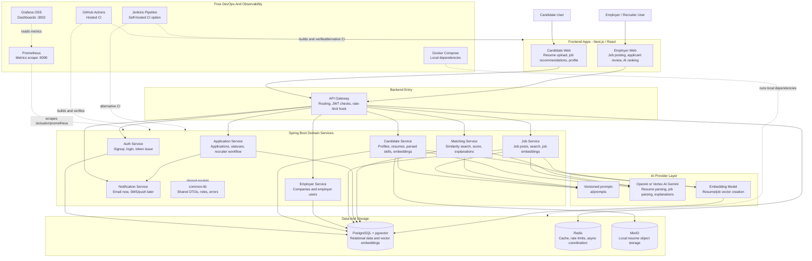
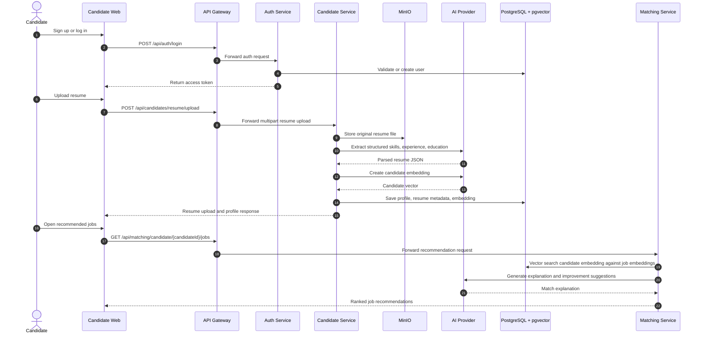
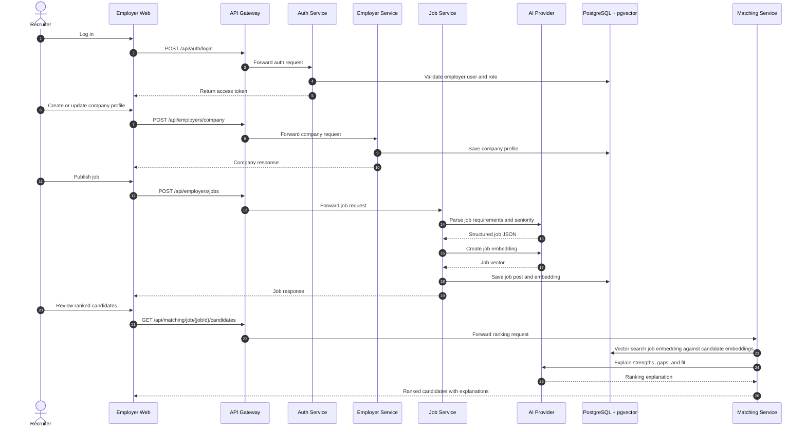
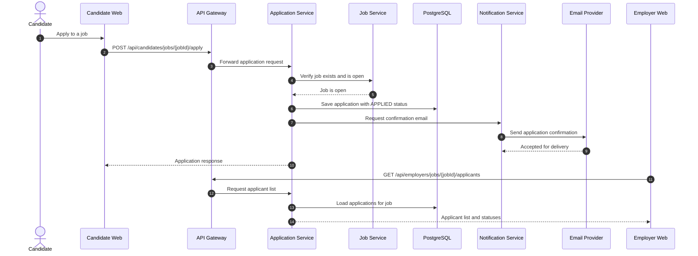
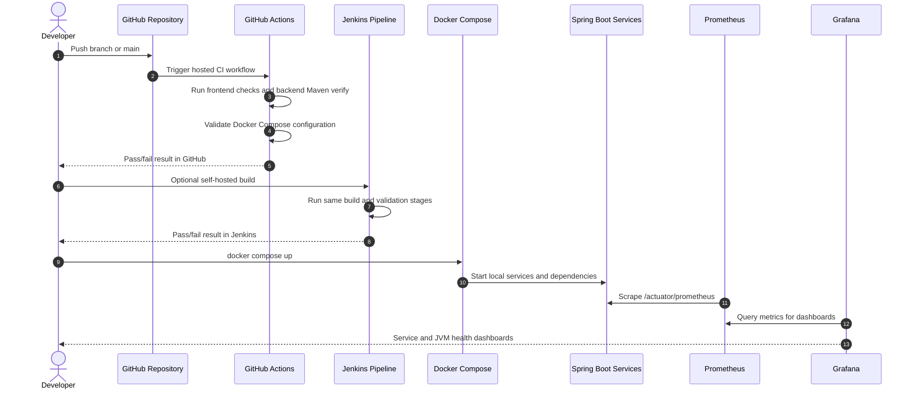

# MVP Architecture

## Runtime Shape

The MVP uses a monorepo with separate web apps and microservice-style Spring
Boot services.
PostgreSQL with pgvector stores operational data and vector embeddings. Redis is
reserved for short-lived cache, rate limiting, and async coordination. MinIO is
used locally for resume object storage. Prometheus scrapes Spring Boot Actuator
metrics, and Grafana displays service health and JVM/application dashboards.

## Whole System Architecture Diagram

This diagram shows the full MVP runtime from users to frontend apps, gateway,
domain services, AI integrations, storage, DevOps, and observability. The arrows
show the normal request/data direction. Services remain in one monorepo for MVP
speed, but each backend module has a clear boundary so it can later be deployed
independently.

## Sequence Diagrams

### Candidate Signup, Resume Upload, And Job Recommendations

This is the most important candidate MVP flow. The fake MVP token in the current
scaffold should be replaced with real JWT signing/validation before production.

### Employer Job Posting And Candidate Ranking

This flow explains how an employer creates a job and later reviews AI-ranked
candidate matches.

### Candidate Application And Notification

This flow shows how the portal handles an application after the candidate chooses
a job.

### Observability And CI Feedback Loop

This diagram shows how code changes become verified builds and how local runtime
health becomes visible in Prometheus and Grafana.

## Backend Microservices

Yes, the backend is intentionally split into microservice-style Spring Boot
modules. Each domain service can eventually be built, deployed, scaled, and owned
independently. For MVP speed, they live in one monorepo and share a parent Maven
build plus `common-lib`.

Current service modules:

| Module                 | Default Port | Primary Responsibility                                     |
| ---------------------- | ------------ | ---------------------------------------------------------- |
| `api-gateway`          | `8080`       | Single backend entry point and route/security boundary.    |
| `auth-service`         | `8081`       | Signup, login, token issue, and role-aware identity flows. |
| `candidate-service`    | `8082`       | Candidate profiles, resume uploads, parsing, embeddings.   |
| `employer-service`     | `8083`       | Company profiles and employer/recruiter workflows.         |
| `job-service`          | `8084`       | Job creation, publishing, search, parsing, embeddings.     |
| `application-service`  | `8085`       | Applications, applicant review, and status transitions.    |
| `matching-service`     | `8086`       | AI matching, scoring, vector search, explanations.         |
| `notification-service` | `8087`       | Email notifications first, other channels later.           |
| `common-lib`           | N/A          | Shared Java models, API wrappers, roles, and errors.       |

## Microservices Vs Docker Vs Kubernetes

These technologies solve different problems:

| Concept        | Primary Job                                                                                                     | Project Usage                                                                                                                       |
| -------------- | --------------------------------------------------------------------------------------------------------------- | ----------------------------------------------------------------------------------------------------------------------------------- |
| Microservices  | Split backend responsibilities by business domain and API boundary.                                             | Used now through separate Spring Boot modules for auth, candidate, employer, job, application, matching, notification, and gateway. |
| Docker         | Package an application and its runtime dependencies into a container image.                                     | Used now through service Dockerfiles and Docker Compose for local infrastructure.                                                   |
| Docker Compose | Run multiple local containers from one YAML file.                                                               | Used now for Postgres, Redis, MinIO, Prometheus, and Grafana.                                                                       |
| Kubernetes     | Orchestrate containerized workloads across a cluster with scheduling, scaling, service discovery, and rollouts. | Included as starter manifests, but not the default MVP path.                                                                        |

The MVP does use Docker. It does not make Kubernetes the first runtime because a
cluster adds operational overhead: nodes, ingress, service discovery, secrets,
resource limits, monitoring, deployments, and cluster upgrades. For early
validation, Docker Compose locally and Cloud Run later are enough. Move to GKE or
another Kubernetes platform when the product needs advanced orchestration,
custom networking, service mesh, workload identity, or high-control multi-service
operations.

## Services

- API Gateway: central entry point, JWT validation, rate-limit hook, route
  ownership boundary.
- Auth Service: candidate and employer signup/login, JWT issue and refresh,
  role model.
- Candidate Service: candidate profiles, resume uploads, resume parsing,
  profile summaries, candidate embeddings.
- Employer Service: company profile and employer user management.
- Job Service: job creation, publishing, search, job parsing, job embeddings.
- Matching Service: candidate-to-job and job-to-candidate matching, weighted
  score calculation, explanation generation, gap detection.
- Application Service: applications, statuses, applicant list, recruiter
  workflow, AI ranking integration.
- Notification Service: email notification first, later SMS, WhatsApp, and push.

## Roles

- CANDIDATE
- EMPLOYER_ADMIN
- RECRUITER
- ADMIN

## Current Scaffold Status

The project currently implements a production-shaped scaffold, not the complete
production system. Candidate Service has JPA entities and repositories for
profiles and resume metadata. Auth Service issues a fake MVP token. Employer,
job, application, matching, and notification services expose placeholder flows
that match the intended contracts but still need persistence, validation depth,
real AI provider calls, and workflow integrations.

## DevOps And Observability

- GitHub Actions runs hosted CI for frontend typecheck/build, backend Maven
  verify, and Docker Compose validation.
- `Jenkinsfile` provides the same free pipeline option for self-hosted Jenkins.
- Prometheus runs locally on port `9090` and scrapes backend
  `/actuator/prometheus` endpoints.
- Grafana OSS runs locally on port `3002` with a provisioned Prometheus data
  source and overview dashboard.

## Deployment Direction

Start with Docker Compose locally. Deploy services to Cloud Run for the fastest
MVP path or GKE when service mesh, workload identity, or deeper Kubernetes
control becomes necessary. Terraform placeholders are included but should stay
minimal until environments stabilize.

## References

- GitHub Actions billing:
  https://docs.github.com/en/billing/concepts/product-billing/github-actions
- Jenkins Pipeline: https://www.jenkins.io/doc/book/pipeline/
- Prometheus docs:
  https://prometheus.io/docs/prometheus/latest/getting_started/
- Grafana provisioning:
  https://grafana.com/docs/grafana/latest/administration/provisioning/
