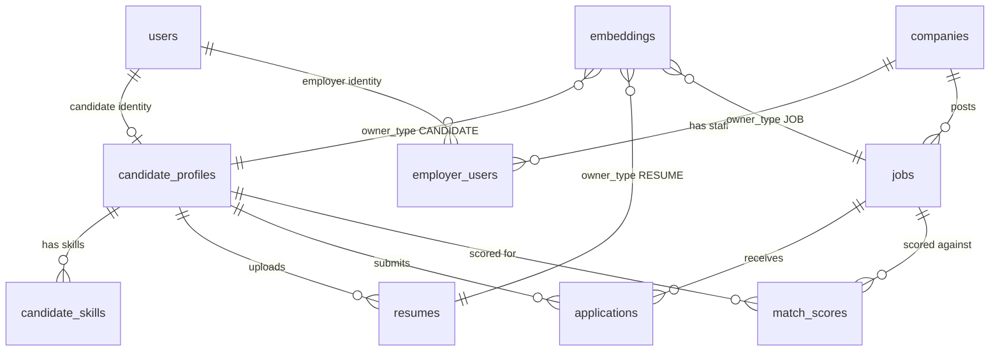

# Core Database Schema

PostgreSQL is the system of record. Add pgvector extension before creating
embedding columns.

```sql
create extension if not exists vector;
```

The current seed script creates these MVP tables without strict foreign-key
constraints so services with placeholder auth and in-memory flows can still be
tested independently. Add migrations and referential constraints before
production.

## Current Implementation Status

The database schema is broader than the code that is fully persisted today.
This is intentional for the MVP scaffold: it gives each service a target data
shape while allowing service endpoints to be built incrementally.

| Area | Current state |
| --- | --- |
| Candidate profile | Implemented as JPA entity `CandidateProfile` and table `candidate_profiles`. |
| Resume metadata | Implemented as JPA entity `ResumeDocument` and table `resumes`. |
| Auth, employer, job, application, matching | Tables exist in `scripts/seed-data.sql`; most service endpoints currently return DTO scaffold responses. |
| Embeddings | Table exists for future vector search; candidate embedding service currently returns deterministic placeholder IDs. |
| Frontend models | Candidate and employer web apps use typed fallback view models until API hooks are wired. |

## Domain Relationship Overview



The SQL seed file does not currently enforce these relationships with foreign
keys. Treat the diagram as the intended domain relationship model.

## Database Tables

| Table | Owner service | Purpose | Main fields |
| --- | --- | --- | --- |
| `users` | Auth Service | User identity and role. Other services reference users by ID. | `id`, `email`, `password_hash`, `role`, `status`, `created_at`, `updated_at` |
| `candidate_profiles` | Candidate Service | Candidate profile used for recommendations and applications. | `id`, `user_id`, `full_name`, `headline`, `location`, `total_experience_years`, `current_title`, `desired_title`, `preferred_location`, `open_to_remote`, `ai_summary` |
| `candidate_skills` | Candidate Service | Normalized candidate skills extracted from profile or resume data. | `id`, `candidate_id`, `skill_name`, `skill_level`, `years_experience` |
| `resumes` | Candidate Service | Resume file metadata and AI parse output. File bytes live in object storage. | `id`, `candidate_id`, `file_url`, `parsed_json`, `ai_summary`, `embedding_id`, `created_at` |
| `companies` | Employer Service | Employer company profile. | `id`, `name`, `website`, `industry`, `size`, `created_at` |
| `employer_users` | Employer Service | Relationship between user accounts and companies. | `id`, `user_id`, `company_id`, `title`, `role` |
| `jobs` | Job Service | Job posting and AI parse metadata. | `id`, `company_id`, `created_by`, `title`, `description`, `location`, `employment_type`, `experience_min`, `experience_max`, `salary_min`, `salary_max`, `status`, `parsed_json`, `embedding_id`, `created_at` |
| `applications` | Application Service | Candidate application workflow. | `id`, `job_id`, `candidate_id`, `status`, `match_score`, `ai_summary`, `applied_at`, `updated_at` |
| `match_scores` | Matching Service | Candidate-to-job score breakdown and explanation. | `id`, `job_id`, `candidate_id`, `overall_score`, `skills_score`, `experience_score`, `title_score`, `location_score`, `ai_reasoning_score`, `explanation`, `missing_skills`, `created_at` |
| `embeddings` | Shared / Matching | pgvector storage for semantic search across candidates, resumes, and jobs. | `id`, `owner_type`, `owner_id`, `model`, `vector`, `created_at` |

## Implemented JPA Entities

### CandidateProfile

Source: `backend/candidate-service/src/main/java/com/aijobs/candidate/entity/CandidateProfile.java`

`CandidateProfile` persists to `candidate_profiles`.

| Field | Type | Meaning |
| --- | --- | --- |
| `id` | `UUID` | Candidate profile ID. |
| `userId` | `UUID` | Auth user ID for this candidate. |
| `fullName` | `String` | Candidate display name. |
| `headline` | `String` | Short professional headline. |
| `location` | `String` | Candidate current location. |
| `totalExperienceYears` | `Integer` | Total years of work experience. |
| `currentTitle` | `String` | Current job title. |
| `desiredTitle` | `String` | Desired next role. |
| `preferredLocation` | `String` | Preferred work location. |
| `openToRemote` | `boolean` | Whether remote work is acceptable. |
| `aiSummary` | `String` | Generated candidate profile summary. |
| `createdAt`, `updatedAt` | `Instant` | Audit timestamps. |

### ResumeDocument

Source: `backend/candidate-service/src/main/java/com/aijobs/candidate/entity/ResumeDocument.java`

`ResumeDocument` persists to `resumes`.

| Field | Type | Meaning |
| --- | --- | --- |
| `id` | `UUID` | Resume metadata record ID. |
| `candidateId` | `UUID` | Candidate profile ID. |
| `fileUrl` | `String` | Object storage URL for resume bytes. |
| `parsedJson` | `String` | AI-extracted resume structure as JSON text. |
| `aiSummary` | `String` | AI-generated resume summary. |
| `embeddingId` | `UUID` | Link to generated embedding record or placeholder ID. |
| `createdAt` | `Instant` | Upload timestamp. |

## API DTO Models

The backend uses Java records for most request and response shapes.

| Service | Request models | Response models |
| --- | --- | --- |
| Auth | `AuthRequest(email, password, role)` | `AuthResponse(accessToken, tokenType, role)` |
| Candidate | `CandidateProfileRequest(...)` | `CandidateProfileResponse(...)`, `ResumeUploadResponse(...)` |
| Employer | `CompanyRequest(name, website, industry, size)` | `CompanyResponse(id, name, website, industry, size)` |
| Job | `JobRequest(...)` | `JobResponse(...)` |
| Application | `ApplicationRequest(jobId, candidateId)` | `ApplicationResponse(id, jobId, candidateId, status, matchScore, aiSummary)` |
| Matching | `MatchExplainRequest(candidateId, jobId, skillsScore, experienceScore, titleScore, locationScore, aiReasoningScore)` | `MatchScoreResponse(candidateId, jobId, overallScore, score breakdown, explanation, missingSkills)` |
| Notification | `EmailNotificationRequest(to, subject, body)` | `ApiResponse<String>` |

Shared models live under `backend/common-lib`:

- `ApiResponse<T>(data, message, timestamp)`
- `ErrorResponse(code, message, details, timestamp)`
- `UserRole`: `CANDIDATE`, `EMPLOYER_ADMIN`, `RECRUITER`, `ADMIN`
- `ApplicationStatus`: `APPLIED`, `AI_REVIEWED`, `SHORTLISTED`, `INTERVIEW`, `REJECTED`, `OFFERED`, `HIRED`

## Frontend View Models

The frontend currently uses typed fallback data until the real API hooks are
connected.

| App | Model | Fields |
| --- | --- | --- |
| Candidate Web | `RecommendedJob` | `id`, `title`, `company`, `location`, `matchScore`, `explanation` |
| Employer Web | `RankedCandidate` | `id`, `name`, `headline`, `matchScore`, `recruiterSummary` |

Candidate view model source:
`frontend/candidate-web/src/types/job.ts`

Employer view model source:
`frontend/employer-web/src/types/candidate.ts`
