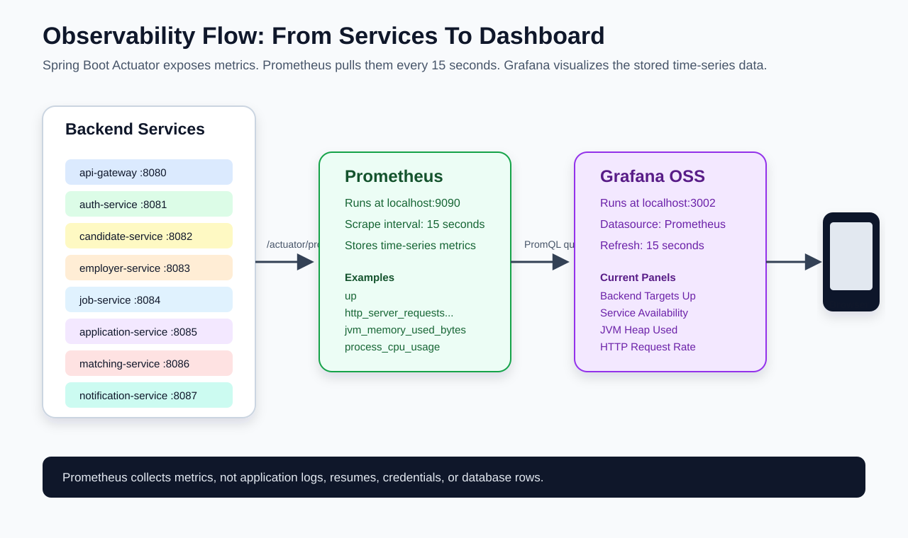
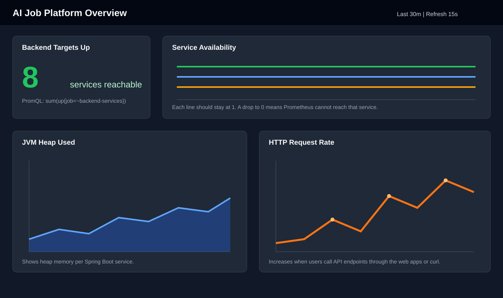

# DevOps Pipeline And Observability

This project includes a free DevOps and observability setup that is appropriate
for an MVP:

- GitHub Actions for hosted CI on public repositories and included/free-tier
  minutes depending on account plan.
- Jenkinsfile for teams that prefer a fully self-hosted, open-source CI server.
- Prometheus for metrics collection.
- Grafana OSS for dashboards.

The project intentionally does not add or edit `.gitlab-ci.yml` so it stays clear
of the earlier request not to change GitLab CI configuration.

## Quick Summary

The DevOps pipeline validates code before it is merged or trusted. It checks
frontend formatting, TypeScript, frontend builds, backend Maven verification,
and Docker Compose configuration.

Prometheus collects numeric time-series metrics from the backend services.
Grafana reads those metrics from Prometheus and displays dashboards that help a
developer see service health, memory usage, and request traffic.

## Example Pictures

The images below are example visual explanations stored in this repository.
They are not screenshots from a live production system; they are diagrams and
dashboard mockups that explain what the current project configuration does.






## DevOps Pipeline

### What Triggers The Pipeline

GitHub Actions runs from `.github/workflows/ci.yml`.

| Trigger             | Meaning                                           |
| ------------------- | ------------------------------------------------- |
| `push`              | Runs when code is pushed to `main` or `develop`.  |
| `pull_request`      | Runs when a pull request is opened or updated.    |
| `workflow_dispatch` | Allows a manual run from the GitHub Actions page. |

Jenkins runs from `Jenkinsfile`. Jenkins can be triggered manually, by a GitHub
webhook, or by a scheduled job depending on how the Jenkins server is
configured.

### GitHub Actions Jobs And Stages

GitHub Actions splits the checks into three jobs. These jobs can run in
parallel on GitHub-hosted runners.

| Job                                | Stage / Step                   | Command Or Action                          | What It Does                                                               | What It Catches                                                                           |
| ---------------------------------- | ------------------------------ | ------------------------------------------ | -------------------------------------------------------------------------- | ----------------------------------------------------------------------------------------- |
| Frontend typecheck and build       | Check out repository           | `actions/checkout@v4`                      | Downloads the repository onto the runner.                                  | Missing workflow access or checkout problems.                                             |
| Frontend typecheck and build       | Set up Node.js                 | `actions/setup-node@v4`, Node `22`         | Installs the Node version expected by the web apps.                        | Version mismatch between local and CI.                                                    |
| Frontend typecheck and build       | Install workspace dependencies | `npm install`                              | Installs root and workspace dependencies.                                  | Broken `package-lock.json`, missing packages, dependency resolution failures.             |
| Frontend typecheck and build       | Check formatting               | `npm run format:check`                     | Runs Prettier check across markdown, JSON, YAML, TypeScript, TSX, and CSS. | Unformatted docs, config, and frontend files.                                             |
| Frontend typecheck and build       | Typecheck web apps             | `npm run typecheck:web`                    | Runs TypeScript validation for candidate and employer web apps.            | Type errors, invalid props, invalid imports, API type mismatches.                         |
| Frontend typecheck and build       | Build web apps                 | `npm run build:web`                        | Builds both Next.js apps.                                                  | Build-time errors, route/app issues, invalid production bundles.                          |
| Backend Maven verify               | Check out repository           | `actions/checkout@v4`                      | Downloads the repository for backend validation.                           | Checkout problems.                                                                        |
| Backend Maven verify               | Set up Java                    | `actions/setup-java@v4`, Temurin Java `25` | Installs Java and enables Maven cache.                                     | Wrong Java version, missing JDK, slow dependency downloads.                               |
| Backend Maven verify               | Verify backend modules         | `mvn -B -f backend/pom.xml verify`         | Compiles and verifies all Maven modules.                                   | Java compile errors, failing tests, dependency or plugin issues.                          |
| Docker Compose configuration check | Check out repository           | `actions/checkout@v4`                      | Downloads the repository for Compose validation.                           | Checkout problems.                                                                        |
| Docker Compose configuration check | Validate Compose file          | `docker compose config`                    | Parses and normalizes `docker-compose.yml`.                                | Invalid YAML, invalid service definitions, broken variable syntax, bad volume/port shape. |

### Jenkins Stages

Jenkins runs the same checks as a sequential pipeline:

| Order | Jenkins Stage                 | Command                            | Purpose                                                       |
| ----- | ----------------------------- | ---------------------------------- | ------------------------------------------------------------- |
| 1     | Install Frontend Dependencies | `npm install`                      | Install Node dependencies for both web apps.                  |
| 2     | Check Formatting              | `npm run format:check`             | Make sure committed docs/config/frontend files are formatted. |
| 3     | Typecheck Web Apps            | `npm run typecheck:web`            | Validate TypeScript for candidate and employer apps.          |
| 4     | Build Web Apps                | `npm run build:web`                | Confirm both Next.js apps build successfully.                 |
| 5     | Verify Backend                | `mvn -B -f backend/pom.xml verify` | Compile and verify all Spring Boot modules.                   |
| 6     | Validate Docker Compose       | `docker compose config`            | Confirm local infrastructure configuration is valid.          |

### Current Pipeline Scope

The current pipeline is a validation pipeline. It does not deploy the
application yet.

Current scope:

- Formatting validation.
- Frontend typecheck.
- Frontend production build.
- Backend Maven verify.
- Docker Compose config validation.

Good next additions:

- Unit tests for backend services.
- Frontend component or page tests.
- API integration tests against Docker Compose dependencies.
- Docker image build and push.
- Dependency vulnerability scanning.
- Deployment to Cloud Run or another MVP hosting target.

## Prometheus

Prometheus is the metrics collector. It pulls metrics from configured targets
on a fixed interval and stores those values as time-series data.

Local URL:

```text
http://localhost:9090
```

Config file:

```text
infra/observability/prometheus/prometheus.yml
```

Local Docker Compose service:

```text
prometheus
```

Scrape interval:

```text
15 seconds
```

### Where Prometheus Collects Data From

Prometheus collects metrics from Spring Boot Actuator endpoints exposed by
each backend service. The backend services run on the host machine during
local development, so the Prometheus container reaches them through
`host.docker.internal`.

| Prometheus Job         | Target                      | Metrics Endpoint            | Source                      |
| ---------------------- | --------------------------- | --------------------------- | --------------------------- |
| `prometheus`           | `prometheus:9090`           | Prometheus internal metrics | Prometheus container itself |
| `api-gateway`          | `host.docker.internal:8080` | `/actuator/prometheus`      | API Gateway                 |
| `auth-service`         | `host.docker.internal:8081` | `/actuator/prometheus`      | Auth Service                |
| `candidate-service`    | `host.docker.internal:8082` | `/actuator/prometheus`      | Candidate Service           |
| `employer-service`     | `host.docker.internal:8083` | `/actuator/prometheus`      | Employer Service            |
| `job-service`          | `host.docker.internal:8084` | `/actuator/prometheus`      | Job Service                 |
| `application-service`  | `host.docker.internal:8085` | `/actuator/prometheus`      | Application Service         |
| `matching-service`     | `host.docker.internal:8086` | `/actuator/prometheus`      | Matching Service            |
| `notification-service` | `host.docker.internal:8087` | `/actuator/prometheus`      | Notification Service        |

### What Data Prometheus Collects

Spring Boot Actuator and Micrometer expose the metrics. Prometheus stores the
numeric metric samples.

| Metric Type            | Example Metric                                        | What It Means                                                                          |
| ---------------------- | ----------------------------------------------------- | -------------------------------------------------------------------------------------- |
| Target health          | `up`                                                  | Whether Prometheus can reach a configured target. `1` means reachable, `0` means down. |
| HTTP traffic           | `http_server_requests_seconds_count`                  | Number of HTTP requests handled by each backend service.                               |
| HTTP latency           | `http_server_requests_seconds_sum` and bucket metrics | Request timing data that can be used to calculate latency.                             |
| JVM memory             | `jvm_memory_used_bytes`                               | Memory used by each Java service, including heap memory.                               |
| JVM garbage collection | `jvm_gc_pause_seconds_count` and related metrics      | Garbage collection frequency and pause behavior.                                       |
| JVM threads            | `jvm_threads_live_threads`                            | Number of live JVM threads.                                                            |
| Process CPU            | `process_cpu_usage`                                   | CPU usage from the Java process.                                                       |
| System CPU             | `system_cpu_usage`                                    | CPU usage visible to the JVM.                                                          |

Prometheus does not collect resumes, passwords, database rows, or application
logs in this setup. It collects numeric operational metrics.

### Useful Prometheus Queries

Check every configured target:

```promql
up
```

Count how many backend services are currently up:

```promql
sum(up{job=~"api-gateway|auth-service|candidate-service|employer-service|job-service|application-service|matching-service|notification-service"})
```

Show HTTP request rate per service:

```promql
sum by (job) (rate(http_server_requests_seconds_count[5m]))
```

Show JVM heap memory per service:

```promql
sum by (job) (jvm_memory_used_bytes{area="heap"})
```

## Grafana

Grafana is the dashboard and visualization layer. It does not scrape services
directly in this project. Grafana queries Prometheus, and Prometheus is the
data source.

Local URL:

```text
http://localhost:3002
```

Default local credentials:

```text
admin / admin
```

Datasource provisioning:

```text
infra/observability/grafana/provisioning/datasources/prometheus.yml
```

Dashboard provisioning:

```text
infra/observability/grafana/provisioning/dashboards/dashboards.yml
```

Dashboard JSON:

```text
infra/observability/grafana/dashboards/ai-job-platform-overview.json
```

### What Grafana Displays

The current dashboard is named `AI Job Platform Overview`.

| Panel                | What It Shows                                    | How To Read It                                                                                 |
| -------------------- | ------------------------------------------------ | ---------------------------------------------------------------------------------------------- |
| Backend Targets Up   | Number of backend services Prometheus can reach. | In a full local run, this can reach `8`. Lower means some services are stopped or unreachable. |
| Service Availability | Up/down line for each service.                   | `1` means reachable; `0` means down.                                                           |
| JVM Heap Used        | Heap memory used by each Java service.           | Rising memory is normal; constantly rising without dropping can indicate a leak.               |
| HTTP Request Rate    | Requests per second per backend service.         | This increases when users call APIs from the web apps or curl.                                 |

Dashboard PromQL queries:

Backend targets up:

```promql
sum(up{job=~"api-gateway|auth-service|candidate-service|employer-service|job-service|application-service|matching-service|notification-service"})
```

Service availability:

```promql
up{job=~"api-gateway|auth-service|candidate-service|employer-service|job-service|application-service|matching-service|notification-service"}
```

JVM heap used:

```promql
sum by (job) (jvm_memory_used_bytes{area="heap"})
```

HTTP request rate:

```promql
sum by (job) (rate(http_server_requests_seconds_count[5m]))
```

### What Grafana Does Not Display Yet

The dashboard is intentionally small for the MVP. It does not yet display:

- Business KPIs such as resumes uploaded, jobs posted, or applications created.
- AI matching quality metrics.
- Logs or traces.
- PostgreSQL, Redis, or MinIO metrics.
- Alerts.

Those can be added later after the product workflows and persistence model are
more complete.

## End-To-End Local Observability Flow

1. Start local infrastructure:

```bash
./scripts/start-local.sh
```

2. Start one or more backend services:

```bash
cd backend
mvn -pl candidate-service spring-boot:run
```

3. Confirm the service exposes metrics:

```bash
curl http://localhost:8082/actuator/prometheus
```

4. Open Prometheus targets:

```text
http://localhost:9090/targets
```

5. Open Grafana:

```text
http://localhost:3002
```

6. Open the `AI Job Platform Overview` dashboard.

## Troubleshooting

### Grafana Shows No Data

Check Prometheus targets:

```text
http://localhost:9090/targets
```

If targets are down, start the backend services on ports `8080` through
`8087`.

### Prometheus Cannot Reach Host Services

Docker Desktop usually supports `host.docker.internal`. On Linux, Compose also
sets `host.docker.internal:host-gateway` for the Prometheus service.

Test the backend service directly from the host:

```bash
curl http://localhost:8082/actuator/prometheus
```

Then check Prometheus logs:

```bash
docker compose logs prometheus
```

### Prometheus Target Is Down

Common causes:

- The backend service is not running.
- The service is running on a different port.
- The service failed during startup.
- `/actuator/prometheus` is not exposed in that service's `application.yml`.
- Docker cannot resolve `host.docker.internal`.

Fast checks:

```bash
curl http://localhost:8082/actuator/health
curl http://localhost:8082/actuator/prometheus
docker compose ps
docker compose logs prometheus
```

### Grafana Dashboard Is Missing

Check provisioning mounts:

```bash
docker compose logs grafana
ls infra/observability/grafana/provisioning
ls infra/observability/grafana/dashboards
```

Restart Grafana:

```bash
docker compose restart grafana
```

### Grafana Login Does Not Work

The local default is:

```text
admin / admin
```

If you changed the password earlier, Grafana may have stored it in the Docker
volume. If you can lose local Grafana data, recreate that volume:

```bash
docker compose down
docker volume rm ai-job-search-platform_grafana-data
docker compose up -d grafana
```

### Jenkins Cannot Run Docker Compose

Make sure the Jenkins agent user has permission to access Docker. Avoid
mounting the host Docker socket into untrusted Jenkins jobs.

### Jenkins Cannot Find Jenkinsfile

Check:

- The file is named exactly `Jenkinsfile`.
- The Jenkins job points to the correct repository and branch.
- The Jenkins workspace checked out the repository root.

### Jenkins Uses The Wrong Node Or Java Version

Add tool configuration in Jenkins or verify on the agent:

```bash
node -v
npm -v
java -version
mvn -v
```

### GitHub Actions Workflow Does Not Start

Check:

- The workflow file exists at `.github/workflows/ci.yml`.
- The repository has Actions enabled.
- The branch is `main`, `develop`, a pull request branch, or manually
  triggered.

Manual trigger:

1. Open the repository in GitHub.
2. Open `Actions`.
3. Select `AI Job Platform CI`.
4. Click `Run workflow`.

## Interview Questions And Answers

**Q: What does the DevOps pipeline do?**

A: It validates the project automatically. It checks formatting, frontend
TypeScript, frontend production builds, backend Maven verification, and Docker
Compose configuration.

**Q: What are the pipeline stages?**

A: GitHub Actions has three jobs: frontend typecheck/build, backend Maven
verify, and Docker Compose configuration check. Jenkins runs equivalent stages
sequentially: install dependencies, format check, typecheck, build, backend
verify, and Compose validation.

**Q: Is this CI or CD?**

A: It is CI right now. It validates changes, but it does not deploy. CD can be
added later with Docker image publishing and Cloud Run or Kubernetes
deployment stages.

**Q: What does Prometheus do?**

A: Prometheus collects time-series metrics by scraping configured HTTP
endpoints, such as each Spring Boot service's `/actuator/prometheus` endpoint.

**Q: What does Grafana do?**

A: Grafana displays dashboards. In this project, it queries Prometheus and
visualizes service availability, JVM heap usage, and HTTP request rate.

**Q: Does Grafana collect data directly from services?**

A: No. Prometheus collects the metrics. Grafana reads from Prometheus.

**Q: What data is collected?**

A: Numeric operational metrics such as target up/down status, HTTP request
counts, request timing data, JVM memory, JVM thread counts, garbage collection
behavior, and CPU metrics.

**Q: Does this setup collect user resumes or passwords?**

A: No. The current Prometheus setup collects operational metrics only, not
resumes, passwords, database rows, or application logs.

## Official References

References used: GitHub Actions billing, Jenkins Pipeline, Prometheus docs,
Grafana provisioning.

- GitHub Actions billing:
  https://docs.github.com/en/billing/concepts/product-billing/github-actions
- Jenkins Pipeline:
  https://www.jenkins.io/doc/book/pipeline/
- Prometheus getting started:
  https://prometheus.io/docs/prometheus/latest/getting_started/
- Grafana provisioning:
  https://grafana.com/docs/grafana/latest/administration/provisioning/

## Microservices, Docker, And Kubernetes

The backend can be microservice-style without making Kubernetes mandatory.
Microservices define service boundaries. Docker packages services and local
dependencies into containers. Docker Compose runs multiple containers locally.
Kubernetes orchestrates many containers across a cluster.

This MVP uses Docker and Docker Compose now. Kubernetes starter manifests are
included for a future GKE path, but Kubernetes is deferred as the default
runtime until scale, networking, or platform requirements justify the added
complexity.
